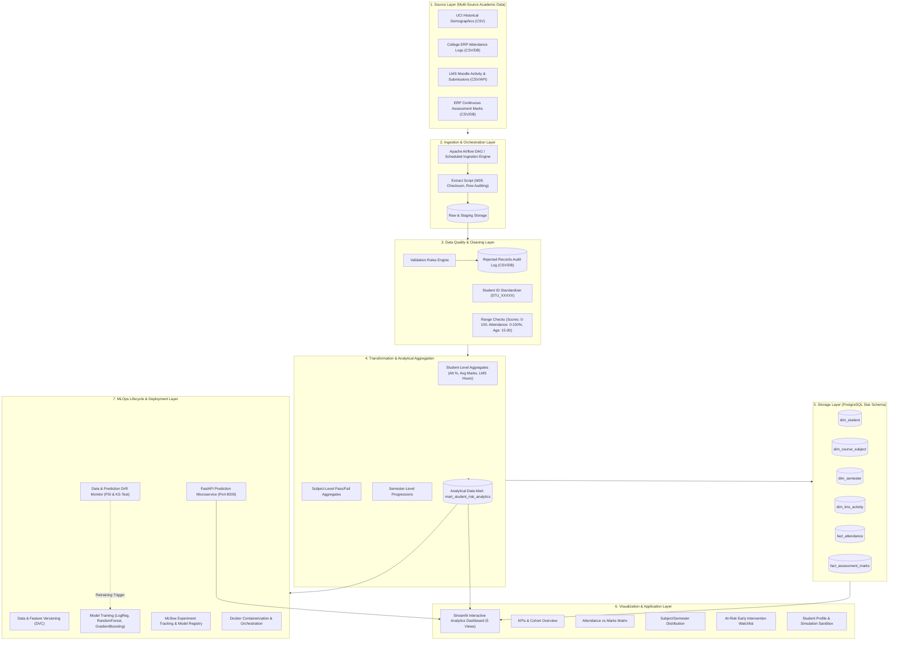
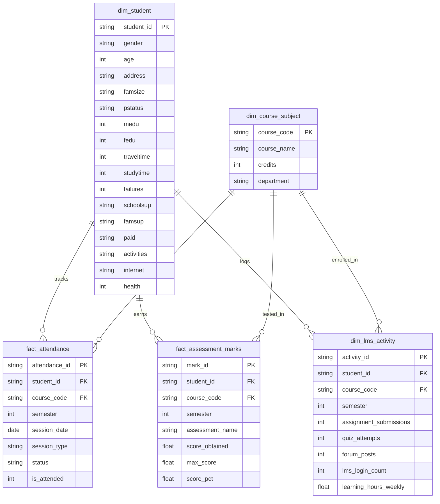
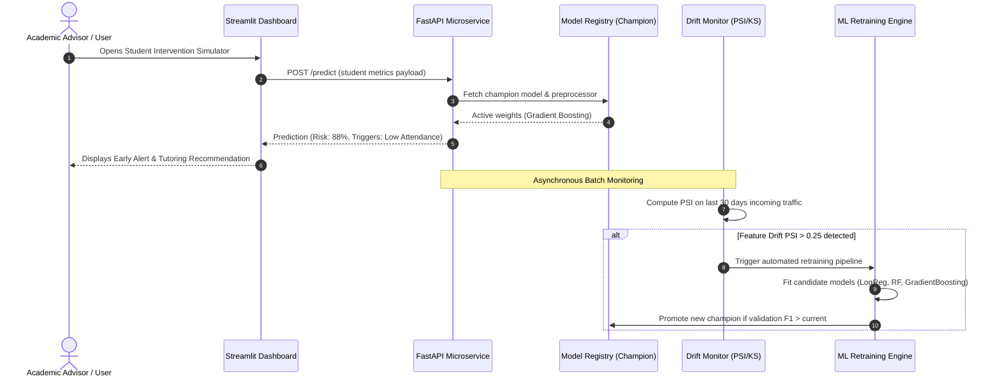

# Architecture Design: Student Performance & Dropout-Risk Prediction System
**Course:** Data Engineering and MLOps  
**System:** Multi-Source Academic Analytics & Real-Time Intervention Platform  

---

## 1. End-to-End System Architecture

The system is engineered as a decoupled, multi-tiered data engineering and MLOps ecosystem.

---

## 2. Storage Layer: Star Schema Design

The relational warehouse follows a dimensional **Star Schema** pattern optimized for fast analytical aggregations across student demographics, attendance sessions, and continuous assessment marks:

---

## 3. Data Layers Explanation

1. **Raw Layer (`data/raw/`)**: Holds immutable extracts from upstream operational systems with raw filenames and source timestamps.
2. **Staging Layer (`data/staging/`)**: Transient zone where incoming files are registered with row counts and MD5 hashes for pipeline auditability.
3. **Cleaned Layer (`data/cleaned/`)**: Standardized datasets that have passed schema, type, and range validation rules. Malformed or duplicate records are diverted to `data/rejected/`.
4. **Analytical Data Mart (`data/analytics/`)**: Feature-engineered, denormalized analytical views (`mart_student_risk_analytics.csv`) consumed directly by BI dashboards and machine learning pipelines.
5. **Warehouse Storage Layer**: PostgreSQL tables structured as dimensions and facts ensuring referential integrity and query speed.

---

## 4. MLOps CI/CD & Retraining Lifecycle

